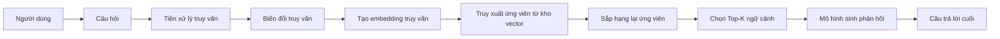
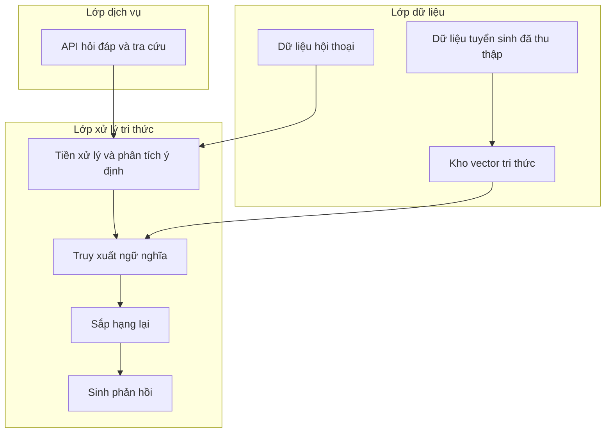
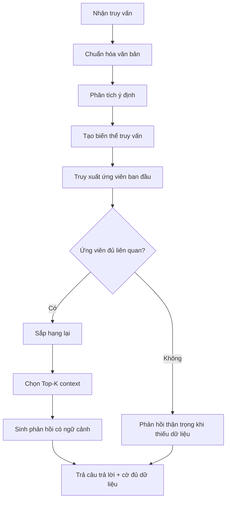
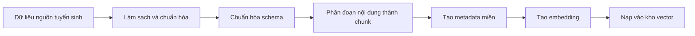
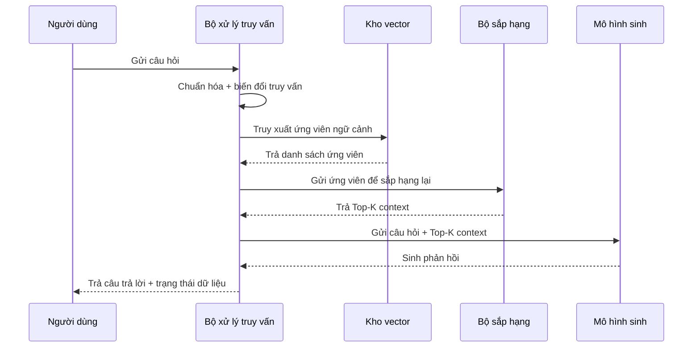
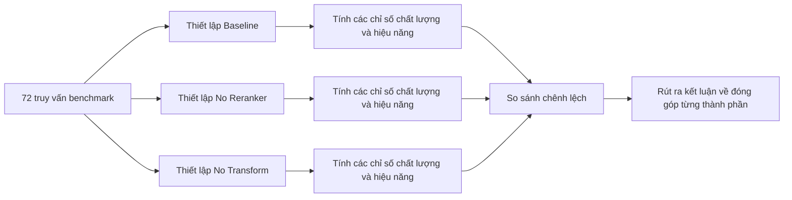
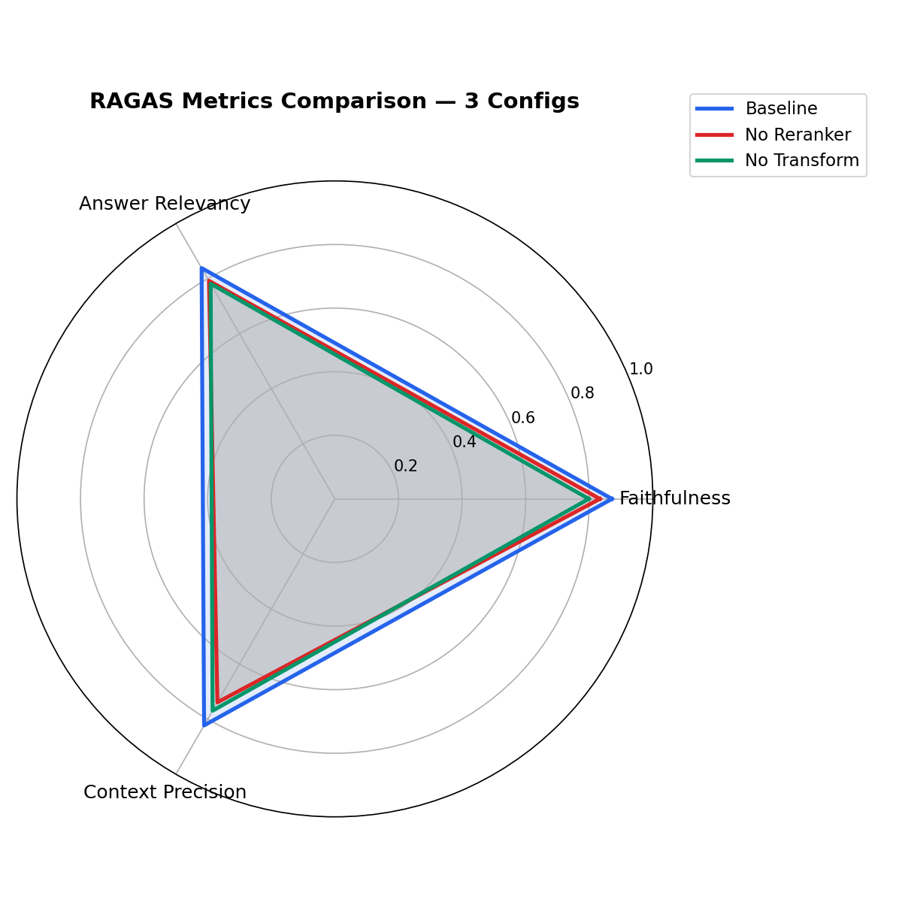
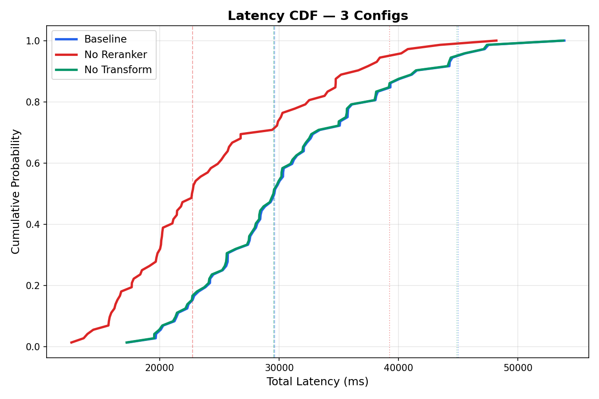
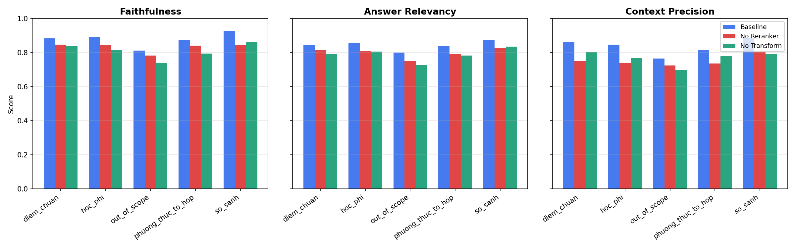
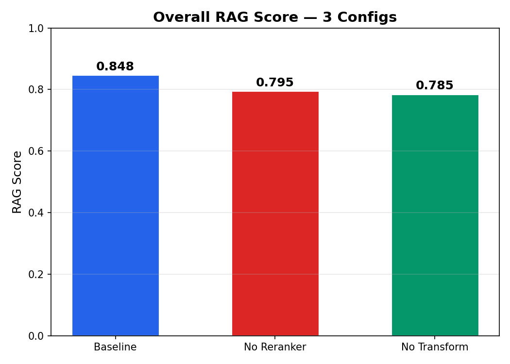

# BÁO CÁO DỰ ÁN HỆ THỐNG RAG CHATBOT TƯ VẤN TUYỂN SINH ĐẠI HỌC

## LỜI MỞ ĐẦU

### 1. Lý do chọn đề tài

Trong bối cảnh chuyển đổi số giáo dục đại học, thông tin tuyển sinh được công bố với tần suất cao, trải rộng trên nhiều nguồn và thường có cấu trúc không đồng nhất. Người học cần tra cứu nhanh các thông tin có tính quyết định như phương thức xét tuyển, tổ hợp môn, học phí và điểm chuẩn. Tuy nhiên, cách tra cứu thủ công truyền thống gây tốn thời gian, dễ bỏ sót và khó tổng hợp. Đặc biệt, trong các truy vấn so sánh hoặc truy vấn có bối cảnh hội thoại, nhu cầu xử lý ngữ nghĩa vượt quá khả năng của các công cụ tìm kiếm từ khóa thông thường.

Trong khi đó, chatbot dựa trên mô hình ngôn ngữ lớn có khả năng diễn đạt tự nhiên nhưng tiềm ẩn rủi ro tạo thông tin không có căn cứ dữ liệu. Đối với miền tư vấn tuyển sinh, sai lệch thông tin có thể ảnh hưởng trực tiếp đến lựa chọn học tập của thí sinh. Vì vậy, cần một kiến trúc vừa tận dụng năng lực sinh ngôn ngữ của mô hình lớn, vừa ràng buộc chặt chẽ bằng tri thức đã thu thập và kiểm soát được. Cách tiếp cận Retrieval-Augmented Generation (RAG) đáp ứng yêu cầu này bằng việc kết hợp truy xuất tri thức với sinh phản hồi trong cùng một quy trình nhất quán.

### 2. Mục tiêu nghiên cứu

Đề tài đặt ra các mục tiêu trọng tâm:

- Xây dựng hệ thống hỏi đáp tuyển sinh tiếng Việt có khả năng hiểu ngữ cảnh, truy xuất tri thức liên quan và sinh phản hồi rõ ràng.
- Thiết kế pipeline RAG theo hướng mô-đun, có khả năng mở rộng và dễ đánh giá định lượng.
- Nâng cao chất lượng truy xuất bằng các kỹ thuật tiền xử lý truy vấn, biến đổi truy vấn và sắp hạng lại tài liệu.
- Đánh giá hiệu quả hệ thống bằng bộ chỉ số chất lượng và hiệu năng, đồng thời phân tích đóng góp của từng thành phần thông qua thực nghiệm ablation.

### 3. Đối tượng và phạm vi nghiên cứu

Đối tượng nghiên cứu là kiến trúc RAG áp dụng cho bài toán tư vấn tuyển sinh đại học.

Phạm vi nghiên cứu bao gồm:

- Dữ liệu tuyển sinh, điểm chuẩn, học phí và nội dung mô tả từ các trường đại học.
- Chuỗi xử lý truy vấn từ đầu vào ngôn ngữ tự nhiên đến phản hồi cuối cùng.
- Các chỉ số đánh giá chất lượng truy xuất và chất lượng phản hồi.

Nghiên cứu không tập trung vào thiết kế mỹ thuật giao diện hay các vấn đề hạ tầng triển khai đa vùng quy mô lớn, mà tập trung vào lõi thuật toán và hiệu quả học thuật của hệ thống RAG.

### 4. Phương pháp nghiên cứu

Đề tài sử dụng kết hợp các phương pháp:

- Phân tích hệ thống: mô hình hóa thành phần dữ liệu, truy xuất, sinh phản hồi và đánh giá.
- Thực nghiệm định lượng: đo chất lượng bằng các thước đo reference-free và đo hiệu năng bằng độ trễ, tỷ lệ lỗi.
- Ablation study: loại bỏ có kiểm soát từng thành phần để định lượng mức đóng góp.
- Đối chiếu ứng dụng: so sánh với cách tra cứu truyền thống nhằm làm rõ giá trị thực tiễn.

### 5. Cấu trúc báo cáo

Báo cáo gồm sáu chương:

- Chương 1: Tổng quan đề tài.
- Chương 2: Cơ sở lý thuyết.
- Chương 3: Phân tích và thiết kế hệ thống.
- Chương 4: Xây dựng hệ thống.
- Chương 5: Thực nghiệm và đánh giá.
- Chương 6: Kết luận và hướng phát triển.

---

# CHƯƠNG 1. TỔNG QUAN ĐỀ TÀI

Chương này trình bày:
- Bản chất bài toán tư vấn tuyển sinh dưới góc nhìn xử lý ngôn ngữ và truy xuất thông tin.
- Những hạn chế của các cách tiếp cận truyền thống.
- Vai trò của chatbot AI và động cơ chuyển sang kiến trúc RAG.
- Lợi ích của RAG trong bài toán hỏi đáp theo ngữ cảnh.

## 1.1. Giới thiệu bài toán tư vấn tuyển sinh đại học

Bài toán tư vấn tuyển sinh có thể xem là một bài toán hỏi đáp miền hẹp (domain-specific QA) với các đặc trưng:

- Tập tri thức lớn, thay đổi theo chu kỳ năm học.
- Nhiều thực thể định danh: mã trường, mã ngành, tổ hợp, mức học phí, chỉ tiêu.
- Nhiều lớp ý định truy vấn: tra cứu trực tiếp, so sánh, giải thích, xác minh.

Về mặt hệ thống, đầu vào là câu hỏi ngôn ngữ tự nhiên; đầu ra mong muốn là phản hồi ngắn gọn, đúng trọng tâm, có căn cứ dữ liệu và phù hợp ngữ cảnh hội thoại. Thách thức cốt lõi là chuyển hóa một truy vấn có thể mơ hồ hoặc viết tắt thành quá trình truy xuất chính xác, sau đó tổng hợp thành phản hồi mạch lạc.

## 1.2. Những khó khăn trong việc tra cứu thông tin tuyển sinh

Khó khăn chính có thể phân thành bốn nhóm:

1. Dữ liệu phân mảnh: thông tin nằm ở nhiều tài liệu khác nhau và không đồng nhất về cấu trúc.
2. Nhiễu ngôn ngữ truy vấn: câu hỏi ngắn, viết tắt, thiếu thành phần ngữ cảnh.
3. Nhiễu truy xuất: tài liệu dài chứa nhiều phần không liên quan trực tiếp tới câu hỏi.
4. Rủi ro suy diễn: khi thiếu ngữ cảnh, mô hình sinh có thể tạo phản hồi nghe hợp lý nhưng không đúng dữ liệu.

Vì vậy, một hệ tư vấn tuyển sinh đáng tin cậy phải có cơ chế nhận biết đủ/thiếu dữ liệu và kiểm soát quá trình sinh phản hồi.

## 1.3. Tổng quan về Chatbot AI

Chatbot AI hiện đại có ưu điểm nổi bật ở khả năng hiểu ngôn ngữ tự nhiên và diễn đạt linh hoạt. Tuy nhiên, trong miền yêu cầu độ chính xác cao, chatbot sinh tự do gặp giới hạn vì không luôn gắn với tri thức đã được xác thực. Bài toán tư vấn tuyển sinh do đó cần một kiến trúc lai: giữ năng lực đối thoại của mô hình sinh, đồng thời neo phản hồi vào dữ liệu truy xuất được.

## 1.4. Tổng quan về hệ thống RAG

RAG gồm ba pha chức năng:

- Truy xuất: tìm các đoạn tri thức liên quan nhất với truy vấn.
- Tăng cường ngữ cảnh: đưa các đoạn truy xuất vào ngữ cảnh đầu vào cho mô hình sinh.
- Sinh phản hồi: tạo câu trả lời dựa trên câu hỏi và ngữ cảnh đã tăng cường.

Mục tiêu của RAG không chỉ là “trả lời được”, mà là “trả lời đúng dựa trên dữ liệu có thật”, từ đó giảm hallucination và tăng khả năng kiểm chứng.

## 1.5. Ứng dụng của RAG trong bài toán hỏi đáp

Trong miền tuyển sinh, RAG thể hiện ưu thế ở ba điểm:

- Khả năng cập nhật tri thức: chỉ cần cập nhật kho dữ liệu và chỉ mục truy xuất.
- Khả năng điều kiện hóa theo ngữ cảnh: hỗ trợ truy vấn theo trường/ngành/tổ hợp.
- Khả năng đánh giá định lượng: tách được chất lượng truy xuất và chất lượng phản hồi để tối ưu có mục tiêu.

---

# CHƯƠNG 2. CƠ SỞ LÝ THUYẾT

Chương này trình bày:
- Nền tảng lý thuyết của mô hình ngôn ngữ lớn, embedding và truy xuất ngữ nghĩa.
- Nguyên lý vector database và sắp hạng tài liệu.
- Kiến trúc RAG và các biến thể xử lý truy vấn.
- Các thước đo đánh giá hệ thống RAG theo hướng học thuật.

## 2.1. Mô hình ngôn ngữ lớn (LLM)

LLM sinh phản hồi theo xác suất có điều kiện của chuỗi token:

\[
P(y\mid x)=\prod_{t=1}^{T} P(y_t\mid y_{<t},x)
\]

Trong đó:

- \(x\): ngữ cảnh đầu vào (câu hỏi và context truy xuất),
- \(y\): chuỗi phản hồi,
- \(y_t\): token tại bước \(t\).

Khi không có context đáng tin cậy, mô hình vẫn tối ưu tính trôi chảy theo xác suất ngôn ngữ, nhưng không đảm bảo tính đúng dữ liệu miền. Vì vậy, LLM cần được điều kiện hóa bởi ngữ cảnh truy xuất trong kiến trúc RAG.

### 2.1.1. Cơ chế sinh tự hồi quy và ý nghĩa trong hỏi đáp

Cơ chế tự hồi quy khiến mô hình sinh token tiếp theo dựa trên toàn bộ token trước đó. Vì vậy, phản hồi cuối chịu ảnh hưởng rất mạnh bởi chất lượng prompt và chất lượng ngữ cảnh đi kèm. Trong bài toán tuyển sinh, nếu context đưa vào thiếu hoặc nhiễu, mô hình có thể tạo câu trả lời “hợp ngữ pháp” nhưng lệch dữ kiện. Điều này lý giải vì sao chất lượng retrieval thường quyết định trần chất lượng của toàn hệ thống.

### 2.1.2. Điều khiển hành vi LLM bằng ràng buộc ngữ cảnh

Trong hệ thống RAG, thay vì để mô hình tự suy diễn từ tri thức tham số hóa, câu trả lời được ràng buộc bởi bằng chứng bên ngoài (retrieved evidence). Về nguyên tắc, phản hồi có thể xem là:

\[
\hat{y}=\arg\max_y P(y\mid q,\mathcal{C})
\]

trong đó \(q\) là truy vấn và \(\mathcal{C}\) là tập ngữ cảnh truy xuất. Cùng một truy vấn, thay đổi tập \(\mathcal{C}\) sẽ làm thay đổi đáng kể phản hồi, cho thấy vai trò trung tâm của pha truy xuất.

### 2.1.3. Các tham số sinh và tác động thực tiễn

Một số tham số quan trọng:

- Nhiệt độ (temperature): điều chỉnh độ ngẫu nhiên của phân phối sinh.
- Giới hạn độ dài phản hồi: ảnh hưởng tới độ đầy đủ thông tin và độ trễ.
- Chiến lược giải mã: quyết định mức ổn định của đầu ra.

Trong miền tuyển sinh, mục tiêu thường ưu tiên tính ổn định và chính xác hơn tính sáng tạo, do đó cấu hình sinh nên hướng tới phản hồi nhất quán, ít dao động.

## 2.2. Embedding và biểu diễn văn bản

Mỗi văn bản được ánh xạ thành vector \(\mathbf{v}\in\mathbb{R}^d\). Tương đồng giữa truy vấn và tài liệu được đo bằng cosine similarity:

\[
\operatorname{sim}(\mathbf{q},\mathbf{d})=
\frac{\mathbf{q}\cdot\mathbf{d}}{\lVert\mathbf{q}\rVert\,\lVert\mathbf{d}\rVert}
\]

Giá trị càng lớn thì mức tương đồng ngữ nghĩa càng cao. Nhờ biểu diễn này, hệ thống có thể tìm các đoạn liên quan ngay cả khi câu chữ không trùng khớp hoàn toàn.

### 2.2.1. Không gian ngữ nghĩa và hiện tượng “gần nghĩa xa từ"

Embedding cho phép hai câu diễn đạt khác nhau nhưng cùng ý nghĩa có vị trí gần nhau trong không gian vector. Ví dụ, “điểm chuẩn ngành CNTT” và “mức điểm trúng tuyển công nghệ thông tin” có thể không chung nhiều từ khóa bề mặt nhưng vẫn có tương đồng ngữ nghĩa cao. Đây là lợi thế cốt lõi so với tìm kiếm thuần lexical.

### 2.2.2. Chiến lược tạo embedding cho truy vấn và tài liệu

Trong thực tế, hệ thống cần bảo đảm tính nhất quán giữa embedding của truy vấn và embedding của tài liệu (cùng mô hình, cùng tiền xử lý chính). Nếu không, khoảng cách đo được dễ mất ý nghĩa so sánh. Ngoài ra, độ dài chunk tài liệu ảnh hưởng trực tiếp đến biểu diễn:

- Chunk quá dài: vector “trung bình hóa” nhiều chủ đề, giảm độ sắc nét ngữ nghĩa.
- Chunk quá ngắn: thiếu ngữ cảnh, làm giảm khả năng suy luận ở tầng sinh.

Do đó, chiến lược chunking hợp lý là điều kiện đi kèm bắt buộc của embedding hiệu quả.

### 2.2.3. Hạn chế của embedding và nhu cầu kết hợp kỹ thuật

Embedding có thể gặp hạn chế với dữ kiện định danh rất cụ thể (mã ngành, con số hiếm, ký hiệu). Vì vậy, hệ thống thường cần kết hợp thêm tín hiệu lexical và reranking để tăng tính chính xác ở các truy vấn có thực thể cứng.

## 2.3. Vector Database và tìm kiếm ngữ nghĩa

Vector database tối ưu cho hai tác vụ:

- Lưu trữ tập vector lớn kèm metadata.
- Truy vấn top-\(k\) vector gần nhất theo một độ đo khoảng cách/tương đồng.

Kết quả truy xuất thường là tập ứng viên \(\mathcal{D}_k=\{d_1,\dots,d_k\}\) được sắp theo điểm tương đồng giảm dần. Metadata cho phép lọc có điều kiện (ví dụ theo mã trường), làm giảm không gian tìm kiếm và tăng độ chính xác theo miền.

### 2.3.1. Chỉ mục gần đúng và cân bằng tốc độ - độ chính xác

Ở quy mô lớn, tìm kiếm láng giềng gần đúng (Approximate Nearest Neighbor) thường được ưu tiên thay cho tìm kiếm chính xác tuyệt đối vì giảm đáng kể độ trễ. Đổi lại, có thể đánh đổi một phần nhỏ độ chính xác retrieval. Đây là đánh đổi phổ biến trong các hệ thống RAG thời gian thực.

### 2.3.2. Vai trò của metadata filter

Metadata filter giúp giới hạn không gian truy xuất vào miền phù hợp, chẳng hạn cùng mã trường hoặc nhóm thông tin liên quan. Về bản chất, hệ thống thực hiện truy xuất trên tập con:

\[
\mathcal{D}'=\{d\in\mathcal{D}\mid \phi(d)=1\}
\]

trong đó \(\phi\) là điều kiện lọc metadata. Cách này vừa tăng precision vừa giảm nguy cơ kéo nhầm ngữ cảnh ngoài miền câu hỏi.

### 2.3.3. Lựa chọn Top-k và tác động đến generation

Số lượng tài liệu đưa vào ngữ cảnh \(k\) là siêu tham số quan trọng:

- \(k\) nhỏ: giảm nhiễu nhưng dễ thiếu thông tin.
- \(k\) lớn: tăng recall nhưng dễ làm loãng ngữ cảnh.

Do đó, lựa chọn \(k\) cần được hiệu chỉnh theo mục tiêu cụ thể của hệ thống (ưu tiên độ chính xác hay độ bao phủ).

## 2.4. Thuật toán BM25 trong truy xuất tài liệu

Trong lý thuyết truy xuất thông tin, BM25 là thước đo lexical mạnh cho matching theo từ khóa. Công thức BM25 cho tài liệu \(D\) và truy vấn \(Q\):

\[
\operatorname{BM25}(D,Q)=\sum_{t\in Q}
\operatorname{IDF}(t)
\cdot
\frac{f(t,D)(k_1+1)}{f(t,D)+k_1\left(1-b+b\frac{|D|}{\operatorname{avgdl}}\right)}
\]

Trong đó:

- \(f(t,D)\): tần suất từ \(t\) trong tài liệu \(D\),
- \(|D|\): độ dài tài liệu,
- \(\operatorname{avgdl}\): độ dài tài liệu trung bình,
- \(k_1,b\): siêu tham số điều chỉnh.

Về nguyên tắc, kết hợp semantic search và BM25 có thể cải thiện tính bền vững retrieval trước các biến thể ngôn ngữ.

### 2.4.1. Trực giác của BM25 trong bài toán tuyển sinh

BM25 đặc biệt hữu ích khi truy vấn chứa thuật ngữ đặc hiệu như mã ngành, tổ hợp môn, hoặc cụm từ cố định. Trong các trường hợp này, tín hiệu tần suất và độ phân biệt từ khóa giúp hệ thống bám sát thực thể tốt hơn so với chỉ dựa vào tương đồng ngữ nghĩa.

### 2.4.2. Ảnh hưởng của \(k_1\) và \(b\)

- \(k_1\): điều chỉnh mức bão hòa theo tần suất từ; \(k_1\) cao làm điểm nhạy hơn với lặp từ.
- \(b\): điều chỉnh chuẩn hóa theo độ dài tài liệu; \(b\) cao phạt mạnh tài liệu dài.

Trong miền văn bản tuyển sinh thường dài và không đồng đều, chuẩn hóa độ dài có vai trò quan trọng để tránh ưu ái tài liệu dài chỉ vì chứa nhiều từ khóa.

### 2.4.3. Kết hợp BM25 với semantic retrieval

Khung kết hợp phổ biến là chuẩn hóa điểm từng nhánh rồi hợp nhất theo trọng số:

\[
S(d)=\lambda\,\tilde{S}_{sem}(d)+(1-\lambda)\,\tilde{S}_{bm25}(d)
\]

Trong đó \(\tilde{S}\) là điểm đã chuẩn hóa, \(\lambda\in[0,1]\). Cơ chế này giúp tăng tính bền vững trước truy vấn có cả thành phần ngữ nghĩa và thành phần thực thể cứng.

## 2.5. Kiến trúc hệ thống RAG

Kiến trúc RAG tổng quát:

\[
\text{Query} \rightarrow \text{Preprocess/Transform} \rightarrow \text{Retrieve} \rightarrow \text{Rerank} \rightarrow \text{Generate}
\]

Mỗi khâu đảm nhiệm một mục tiêu:

- Khâu đầu giảm nhiễu truy vấn,
- Khâu giữa tăng độ liên quan ngữ cảnh,
- Khâu cuối tối ưu chất lượng phản hồi.

Chất lượng toàn hệ thống phụ thuộc vào chất lượng khâu yếu nhất; do đó cần đánh giá theo chuỗi thay vì chỉ đánh giá đầu ra cuối.

### 2.5.1. Các biến thể RAG thường dùng

Một số biến thể phổ biến:

- Naive RAG: truy xuất một lần, sinh một lần.
- Multi-query RAG: sinh nhiều biến thể truy vấn để tăng recall.
- Iterative RAG: sinh phản hồi tạm, rồi truy xuất bổ sung theo phản hồi trung gian.
- Hybrid RAG: kết hợp semantic và lexical retrieval.

Trong bài toán tuyển sinh, biến thể đa truy vấn và hybrid thường hiệu quả vì truy vấn người dùng đa dạng cách diễn đạt.

### 2.5.2. Điểm nghẽn chất lượng trong chuỗi RAG

Ba điểm nghẽn điển hình:

1. Sai lệch ở truy vấn: câu hỏi mơ hồ, thiếu chuẩn hóa.
2. Sai lệch ở retrieval: context đúng chủ đề nhưng không đúng thực thể.
3. Sai lệch ở generation: mô hình diễn giải quá mức từ context chưa đủ mạnh.

Vì vậy, thiết kế RAG cần cơ chế giảm sai số theo tầng thay vì chỉ tăng năng lực của tầng sinh.

### 2.5.3. Chỉ số nội tại và chỉ số đầu-cuối

Đánh giá RAG nên gồm hai lớp:

- Nội tại retrieval: độ liên quan và tập trung ngữ cảnh.
- Đầu-cuối phản hồi: mức bám sát dữ kiện và trả lời đúng ý hỏi.

Cách phân lớp này giúp định vị nguyên nhân suy giảm chính xác hơn khi tối ưu.

### Sơ đồ kiến trúc tổng quát RAG

## 2.6. Quy trình hoạt động của hệ thống RAG

Quy trình hoạt động được thiết kế theo nguyên tắc tuần tự có kiểm soát:

1. Chuẩn hóa truy vấn và trích xuất tín hiệu ý định.
2. Tạo một hoặc nhiều biến thể truy vấn để mở rộng khả năng truy xuất.
3. Truy xuất tập ứng viên từ chỉ mục vector.
4. Sắp hạng lại ứng viên để tối đa hóa độ liên quan thực sự.
5. Chọn tập context đầu vào cho mô hình sinh.
6. Sinh phản hồi và trả về cờ đủ/thiếu dữ liệu.

Quy trình này tạo điều kiện để phân tích lỗi theo từng tầng và cải tiến có mục tiêu.

### 2.6.1. Tiền xử lý truy vấn

Mục tiêu của tiền xử lý là giảm nhiễu ngôn ngữ bề mặt: chuẩn hóa khoảng trắng, xử lý viết tắt, và thống nhất dạng biểu đạt. Tiền xử lý tốt giúp tăng xác suất truy xuất đúng ngay từ vòng đầu.

### 2.6.2. Biến đổi truy vấn (Query Transformation)

Biến đổi truy vấn tạo thêm góc nhìn truy xuất cho cùng một nhu cầu thông tin. Về trực giác, với tập biến thể \(\mathcal{Q}=\{q_1,\dots,q_m\}\), hệ thống lấy hợp ứng viên:

\[
\mathcal{D}_{union}=\bigcup_{i=1}^{m} \operatorname{TopK}(q_i)
\]

Sau đó mới thực hiện sắp hạng lại. Cách làm này thường tăng recall nhưng cần cơ chế lọc nhiễu mạnh ở bước sau.

### 2.6.3. Reranking và chọn ngữ cảnh cuối

Reranking nhằm tái ước lượng độ liên quan thực sự của ứng viên theo truy vấn gốc. Tập ngữ cảnh cuối \(\mathcal{C}\) được chọn từ danh sách đã rerank với kích thước hữu hạn, bảo đảm cân bằng giữa đủ thông tin và tập trung.

### 2.6.4. Sinh phản hồi có kiểm soát dữ liệu

Giai đoạn sinh phản hồi sử dụng ngữ cảnh đã chọn làm bằng chứng chính. Nếu điểm liên quan không đạt ngưỡng hoặc context không đủ, hệ thống cần chuyển sang phản hồi thận trọng, nêu rõ giới hạn tri thức thay vì suy diễn.

## 2.7. Các phương pháp đánh giá hệ thống RAG

Đề tài sử dụng nhóm chỉ số reference-free thường dùng cho RAG:

- Faithfulness: mức độ phản hồi bám sát context.
- Answer Relevancy: mức độ trả lời đúng trọng tâm câu hỏi.
- Context Precision: mức độ tập trung của context truy xuất.
- RAG Score: điểm tổng hợp.

Điểm tổng hợp được tính theo trung bình cộng:

\[
\operatorname{RAG\ Score}=
\frac{\operatorname{Faithfulness}+\operatorname{Answer\ Relevancy}+\operatorname{Context\ Precision}}{3}
\]

Ngoài ra, hệ thống được đánh giá hiệu năng bằng latency và error rate:

\[
\operatorname{Error\ Rate}=\frac{N_{error}}{N_{total}}
\]

Các chỉ số này tạo thành khung đánh giá cân bằng giữa chất lượng và chi phí thời gian.

### 2.7.1. Faithfulness

Faithfulness phản ánh mức độ các phát biểu trong phản hồi có được hỗ trợ bởi ngữ cảnh hay không. Trực giác là tỷ lệ “mệnh đề có căn cứ” trên tổng mệnh đề quan trọng trong câu trả lời. Chỉ số cao đồng nghĩa phản hồi ít bịa đặt và an toàn hơn trong miền dữ kiện.

### 2.7.2. Answer Relevancy

Answer Relevancy đo mức “trúng câu hỏi”. Một phản hồi có thể đúng dữ kiện nhưng vẫn kém liên quan nếu trả lời lan man hoặc bỏ sót trọng tâm. Vì vậy chỉ số này bổ sung cho Faithfulness, giúp đánh giá cả tính đúng và tính đúng chỗ.

### 2.7.3. Context Precision

Context Precision đánh giá mức tinh gọn của ngữ cảnh: bao nhiêu phần trong context thực sự cần thiết cho câu trả lời. Chỉ số này cao thường cho thấy retrieval và reranking hoạt động tốt, giảm nhiễu cho mô hình sinh.

### 2.7.4. Đánh đổi chất lượng - độ trễ

Trong hệ thống RAG, cải thiện chất lượng thường đi kèm tăng chi phí thời gian (nhiều biến thể truy vấn hơn, reranking sâu hơn). Do đó cần theo dõi đồng thời RAG Score và latency để tìm điểm vận hành tối ưu theo mục tiêu sử dụng.

### 2.7.5. Khung đánh giá theo thực nghiệm ablation

Ablation giúp định lượng đóng góp của từng thành phần bằng cách giữ nguyên mọi yếu tố khác và chỉ thay đổi một thành phần tại mỗi lần thử. Đây là phương pháp phù hợp để kết luận “thành phần nào thực sự tạo giá trị” thay vì suy đoán theo cảm tính.

---

# CHƯƠNG 3. PHÂN TÍCH VÀ THIẾT KẾ HỆ THỐNG

Chương này trình bày:
- Yêu cầu hệ thống và tiêu chí thiết kế.
- Thiết kế kiến trúc tổng thể theo các lớp chức năng.
- Thiết kế dữ liệu, cơ chế truy xuất và sắp hạng.
- Thiết kế chi tiết các bước xử lý truy vấn trong pipeline RAG.

## 3.1. Phân tích yêu cầu hệ thống

Hệ thống cần đáp ứng đồng thời các yêu cầu:

- Đúng dữ liệu: phản hồi bám sát tri thức tuyển sinh đã thu thập.
- Hiểu ngữ nghĩa tiếng Việt: xử lý truy vấn có viết tắt, thiếu chuẩn chính tả nhẹ, diễn đạt đa dạng.
- Tốc độ chấp nhận được: phản hồi trong thời gian đủ tốt cho tương tác.
- Khả năng mở rộng: dễ mở rộng số trường, số tài liệu, số truy vấn benchmark.
- Khả năng kiểm định: có chỉ số định lượng để theo dõi chất lượng theo thời gian.

Các yêu cầu này định hướng việc thiết kế pipeline theo nhiều tầng xử lý thay vì một bước sinh phản hồi trực tiếp.

## 3.2. Chức năng của hệ thống

Hệ thống được triển khai theo các chức năng cốt lõi:

1. Nhập và chỉ mục hóa dữ liệu: chuyển dữ liệu tuyển sinh thô thành các đơn vị tri thức có thể truy xuất.
2. Truy xuất ngữ cảnh: nhận truy vấn và trả về tập ứng viên liên quan.
3. Sắp hạng lại: tái sắp xếp ứng viên để nâng độ phù hợp trước khi sinh phản hồi.
4. Sinh phản hồi hội thoại: tạo câu trả lời tự nhiên dựa trên context chọn lọc.
5. Quản lý ngữ cảnh phiên: tận dụng lịch sử hội thoại gần để xử lý truy vấn đa lượt.
6. Đánh dấu mức đủ dữ liệu: phản hồi minh bạch khi tri thức không đủ.

## 3.3. Thiết kế kiến trúc tổng thể

Kiến trúc tổng thể gồm ba lớp:

- Lớp dữ liệu: dữ liệu tuyển sinh đã thu thập, kho vector và dữ liệu hội thoại.
- Lớp xử lý tri thức: tiền xử lý truy vấn, truy xuất, sắp hạng, sinh phản hồi.
- Lớp dịch vụ: giao tiếp với ứng dụng người dùng qua API.

Nguyên tắc kiến trúc là phân tách trách nhiệm rõ ràng, giúp mỗi thành phần có thể cải tiến độc lập và kiểm thử độc lập.

### Sơ đồ kiến trúc phân lớp

Giải thích hình: Sơ đồ thể hiện kiến trúc ba lớp với hướng phụ thuộc từ trên xuống. Lớp dịch vụ (API) đóng vai trò cổng giao tiếp, tiếp nhận truy vấn và điều phối luồng xử lý. Lớp xử lý tri thức là lõi thuật toán, trong đó truy vấn đi qua các bước chuẩn hóa, truy xuất, sắp hạng và sinh phản hồi. Lớp dữ liệu cung cấp nền tri thức và ngữ cảnh hội thoại để các bước xử lý sử dụng. Dòng chảy này cho thấy: (i) API không xử lý tri thức trực tiếp mà ủy quyền cho lõi RAG; (ii) retrieval phụ thuộc chặt vào kho vector; (iii) ngữ cảnh hội thoại quay lại tác động pha tiền xử lý, từ đó cải thiện khả năng hiểu truy vấn đa lượt. Cấu trúc phân lớp như vậy giúp cô lập trách nhiệm và thuận lợi cho mở rộng độc lập từng tầng.

## 3.4. Thiết kế cơ sở dữ liệu/vector database

### Thiết kế dữ liệu hội thoại

Dữ liệu hội thoại lưu theo mô hình phiên (conversation) và lượt trao đổi (message), cho phép:

- Tái sử dụng ngữ cảnh cho truy vấn tiếp theo,
- Theo dõi lịch sử để phân tích hành vi sử dụng,
- Nâng cấp các chiến lược rewrite dựa trên ngữ cảnh gần.

### Thiết kế chỉ mục tri thức

Mỗi đơn vị tri thức được mô hình hóa thành một bản ghi gồm:

- nội dung văn bản,
- vector embedding,
- metadata miền (trường, loại thông tin, độ tin cậy, nguồn).

Khi truy vấn, hệ thống kết hợp điểm tương đồng vector với điều kiện metadata để giảm nhiễu truy xuất.

## 3.5. Thiết kế cơ chế Hybrid Search (Semantic Search + BM25)

Mục tiêu hybrid search là kết hợp:

- tín hiệu semantic cho hiểu nghĩa,
- tín hiệu lexical cho bám sát thực thể cụ thể.

Về mặt thiết kế, điểm hợp nhất có thể mô hình hóa bởi:

\[
S_{hybrid}(d)=\alpha\,S_{semantic}(d)+(1-\alpha)\,S_{lexical}(d),\quad 0\le\alpha\le1
\]

Trong đó \(\alpha\) điều chỉnh mức ưu tiên ngữ nghĩa/lexical. Khung này cho phép cân bằng giữa khả năng “hiểu ý” và khả năng “khớp đúng thực thể”.

## 3.6. Thiết kế cơ chế Reranking tài liệu

Sau retrieval ban đầu, hệ thống thực hiện reranking để giảm nhiễu trước generation. Điểm rerank có thể biểu diễn:

\[
S_{rerank}(d)=w_k\,S_{keyword}(d)+w_l\,S_{llm}(d),\quad w_k+w_l=1
\]

Trong triển khai thực nghiệm, trọng số được chọn theo hướng ưu tiên tín hiệu ngữ nghĩa do mô hình đánh giá cặp truy vấn-văn bản, đồng thời vẫn giữ thành phần keyword để neo vào thực thể miền tuyển sinh.

## 3.7. Thiết kế luồng xử lý truy vấn

Luồng xử lý được xây dựng theo các bước có chủ đích:

1. Chuẩn hóa: giảm nhiễu chính tả/định dạng.
2. Phân tích ý định: nhận diện loại câu hỏi (điểm chuẩn, học phí, phương thức, so sánh, ngoài phạm vi).
3. Biến đổi truy vấn: tạo các biến thể giúp tăng recall truy xuất.
4. Truy xuất ứng viên: lấy tập tài liệu có điểm gần nhất.
5. Rerank: nâng chất lượng top context.
6. Sinh phản hồi: tạo câu trả lời cuối cùng có kiểm soát dữ liệu.
7. Gắn cờ dữ liệu: thông báo mức đủ/thiếu thông tin.

Điểm mạnh của luồng này là có khả năng giải thích: sai số có thể truy vết về đúng tầng gây lỗi.

### Sơ đồ luồng xử lý truy vấn chi tiết

## 3.8. Thiết kế giao diện người dùng

Theo quan điểm no-code trong báo cáo học thuật, giao diện được xem là lớp tương tác đầu-cuối, không phải trung tâm đóng góp thuật toán. Vai trò của lớp này là:

- Thu nhận truy vấn tự nhiên,
- Hiển thị phản hồi và trạng thái hội thoại,
- Truyền ngữ cảnh phiên giữa các lượt hỏi.

Nhờ đó, trọng tâm nghiên cứu tiếp tục được giữ ở kiến trúc tri thức và chất lượng RAG.

---

# CHƯƠNG 4. XÂY DỰNG HỆ THỐNG

Chương này trình bày:
- Quy trình xây dựng kho tri thức tuyển sinh.
- Chiến lược phân đoạn dữ liệu và tạo embedding.
- Quy trình truy xuất, sắp hạng và sinh phản hồi.
- Cách tổ chức vận hành hệ thống theo vòng đời dữ liệu.

## 4.1. Thu thập và xử lý dữ liệu tuyển sinh

Hệ thống sử dụng crawler chuyên biệt để cào dữ liệu tuyển sinh theo từng trường từ trang nguồn, sau đó chuyển đổi HTML thành dữ liệu JSON có cấu trúc. Quy trình thực tế gồm: lấy trang, tách các khối nội dung tuyển sinh (thông tin trường, phương thức, ngành, học phí, điểm chuẩn), chuẩn hóa trường dữ liệu, và lưu thành bản ghi theo mã trường. Cách triển khai này giúp dữ liệu đầu vào vừa giữ được nội dung gốc, vừa sẵn sàng cho truy xuất theo điều kiện.

### 4.1.1. Mô hình dữ liệu đầu vào

Dữ liệu được tổ chức theo ba lớp thông tin:

- Lớp định danh: mã trường, tên trường, thông tin địa lý, thuộc tính nhận diện.
- Lớp tri thức cốt lõi: phương thức tuyển sinh, ngành đào tạo, tổ hợp môn, học phí, điểm chuẩn.
- Lớp ngữ cảnh mở rộng: mô tả dài, ghi chú, thông tin bổ sung theo niên khóa.

Việc tách lớp giúp hệ thống truy xuất theo hai chiều: truy xuất ngữ nghĩa từ văn bản dài và truy xuất điều kiện từ trường cấu trúc.

Theo schema dataset của crawler, mỗi bản ghi trường được chuẩn hóa theo các trường mức cao sau:

- `university`, `admission_year`, `total_quota`, `source_url`, `scraped_at`
- `admission_overview`, `admission_methods[]`, `programs[]`
- `cutoff_scores`, `timeline`, `tuition`, `score_conversion`, `pdf_urls[]`

Trong đó:

- `admission_methods[]` lưu phương thức xét tuyển và danh sách chương trình theo từng phương thức.
- `programs[]` lưu danh mục ngành ở mức toàn trường để hỗ trợ truy vấn chéo phương thức.
- `cutoff_scores`, `timeline`, `tuition`, `score_conversion` là các nhóm dữ liệu miền có thể xuất hiện tùy trường.

Cách mô hình hóa này giúp hệ thống vừa lưu được cấu trúc tra cứu nhanh, vừa bảo toàn đoạn văn bản dài cho semantic retrieval.

### 4.1.2. Ánh xạ từ cấu trúc trang sang cấu trúc dữ liệu

Crawler triển khai ánh xạ trực tiếp từ các khối nội dung trên trang tuyển sinh sang trường dữ liệu đích. Cụ thể:

- khối “Phương thức xét tuyển” -> `admission_methods[]`
- khối “Danh sách ngành đào tạo” -> `programs[]`
- khối “Điểm chuẩn” -> `cutoff_scores`
- khối “Học phí” -> `tuition`
- khối “Thời gian và hồ sơ” -> `timeline`
- khối “Giới thiệu trường” -> `university`
- khối “File PDF đề án” -> `pdf_urls[]`

Ánh xạ theo khối giúp giảm phụ thuộc vào diễn đạt văn bản tự do, từ đó tăng tính ổn định khi website có thay đổi nhẹ về nội dung.

### 4.1.3. Nguyên tắc chuẩn hóa dữ liệu nguồn

Chuẩn hóa dữ liệu tuân theo các nguyên tắc:

1. Nhất quán định dạng: cùng một kiểu thông tin phải có cùng quy ước biểu diễn.
2. Bảo toàn ngữ nghĩa miền: không rút gọn quá mức làm mất ý nghĩa tuyển sinh.
3. Giữ khả năng truy vết: mỗi đơn vị tri thức có thể gắn về nguồn gốc tương ứng.

Trong quá trình xử lý, hệ thống thực hiện các phép chuẩn hóa cụ thể: chuẩn hóa mã trường về cùng quy ước chữ hoa, đồng nhất tên thuộc tính giữa các nguồn, chuẩn hóa giá trị số (điểm chuẩn/chỉ tiêu), và hợp nhất thông tin trường với dữ liệu điểm chuẩn theo khóa mã trường. Kết quả của bước này là bộ dữ liệu liên kết được, có thể đưa trực tiếp vào pipeline phân đoạn và chỉ mục hóa.

### 4.1.4. Kiểm soát chất lượng dữ liệu trước khi chỉ mục

Trước khi tạo chỉ mục, dữ liệu được rà soát theo ba tiêu chí:

- Độ đầy đủ: các trường cốt lõi không bị thiếu nghiêm trọng.
- Độ hợp lệ: thông tin số liệu tuân theo miền giá trị hợp lý.
- Độ sạch ngôn ngữ: giảm nhiễu ký tự, trùng lặp và mảnh văn bản lỗi.

Ở mức thực thi, hệ thống chạy kiểm tra theo lô trước khi nạp chỉ mục để phát hiện: bản ghi thiếu mã trường, bản ghi thiếu trường cốt lõi, bản ghi điểm chuẩn không khớp ngữ cảnh ngành, và bản ghi trùng lặp cao. Những bản ghi lỗi được tách khỏi lô nạp chính để tránh khuếch đại sai số ở các pha retrieval và generation.

### 4.1.5. Độ bao phủ dữ liệu hiện tại và khoảng trống đã biết

Theo đặc tả dataset của crawler, độ bao phủ hiện tại có các điểm cần lưu ý:

- Các phần `admission_overview`, `admission_methods[]`, `programs[]`, `cutoff_scores`, `timeline` (nếu có), `tuition` (nếu có) đã được trích xuất.
- Trường `score_conversion` hiện chưa được triển khai đầy đủ ở parser.
- `pdf_urls[]` hiện mới ghi nhận chưa đủ toàn bộ liên kết PDF trong mọi trường hợp.
- Một số thuộc tính sâu trong `university` (như `english_name`, `phone`, `email`, `founded_year`, `achievements`) còn thiếu ở nhiều bản ghi.

Các khoảng trống này không làm hệ thống dừng hoạt động, nhưng ảnh hưởng trực tiếp đến độ phủ tri thức ở các truy vấn chuyên biệt.

## 4.2. Tiền xử lý dữ liệu

Tiền xử lý là pha hệ thống biến dữ liệu đã cào thành các đơn vị tri thức truy xuất được. Cụ thể, hệ thống làm sạch văn bản, chuẩn hóa biểu diễn, chia nội dung thành chunk theo loại thông tin, rồi gắn metadata để mỗi chunk có thể được lọc và xếp hạng đúng ngữ cảnh câu hỏi.

### 4.2.1. Làm sạch và chuẩn hóa ngôn ngữ

Các thao tác chính:

- Chuẩn hóa khoảng trắng, ký tự xuống dòng và dấu câu.
- Hạn chế nhiễu ký tự đặc biệt không mang thông tin.
- Đồng nhất các cách biểu diễn cùng khái niệm miền tuyển sinh.

Ngoài các thao tác cơ bản, hệ thống còn chuẩn hóa các mẫu viết tắt phổ biến của miền tuyển sinh để giảm trường hợp truy vấn người dùng và dữ liệu nguồn không khớp chỉ vì khác cách viết. Mục tiêu là giảm phương sai ngôn ngữ bề mặt, giúp embedding phản ánh ngữ nghĩa nhất quán hơn.

### 4.2.2. Phân đoạn tri thức (Chunking)

Tài liệu được chia thành các đoạn có độ dài vừa đủ để:

- giữ tính đầy đủ ngữ cảnh,
- tránh loãng chủ đề,
- tối ưu chi phí truy xuất và sinh phản hồi.

Với tài liệu độ dài \(L\), kích thước chunk \(s\), và độ chồng lấp \(o\), số chunk xấp xỉ:

\[
N_{chunk}\approx\left\lceil\frac{L-o}{s-o}\right\rceil
\]

Biểu thức này cho thấy tăng \(o\) giúp giảm đứt gãy ngữ cảnh nhưng làm tăng số chunk và chi phí chỉ mục.

### 4.2.3. Thiết kế metadata phục vụ truy xuất

Mỗi chunk được gắn metadata vận hành gồm định danh trường, loại chunk, miền nội dung và nhãn mục đích tri thức; với dữ liệu định lượng còn có thêm trường chuyên biệt như điểm số, mã ngành hoặc tổ hợp. Nhờ đó, retrieval không chỉ tìm theo gần nghĩa mà còn lọc được đúng loại thông tin cần trả lời.

### 4.2.4. Đánh đổi trong tiền xử lý

Tiền xử lý tối ưu là bài toán cân bằng:

- quá “mạnh” có thể làm mất sắc thái ngữ nghĩa,
- quá “nhẹ” làm giữ lại nhiều nhiễu,
- chunk quá nhỏ làm thiếu ngữ cảnh,
- chunk quá lớn làm giảm độ tập trung.

Do đó, các siêu tham số tiền xử lý cần được hiệu chỉnh cùng với kết quả đánh giá thực nghiệm thay vì chọn cố định theo trực giác.

### 4.2.5. Chiến lược chunking theo khuyến nghị dữ liệu crawler

Dựa trên cấu trúc dataset, hệ thống áp dụng logic chunking theo bốn nhóm chính:

1. Chunk metadata trường: thông tin `university` kết hợp `admission_overview`.
2. Chunk theo phương thức: mỗi phần tử `admission_methods[]` được xem như một đơn vị tri thức tương đối độc lập.
3. Chunk danh mục ngành toàn trường: từ `programs[]` để phục vụ truy vấn chéo phương thức.
4. Chunk văn bản thô theo miền: `cutoff_scores.raw_text`, `tuition.raw_text`, `timeline.raw_text` (và `score_conversion.raw_text` khi có).

Cách phân nhóm này giúp đồng thời hỗ trợ cả truy vấn fact lookup và truy vấn tổng hợp nhiều ngữ cảnh.

### Sơ đồ pipeline xây dựng tri thức từ dữ liệu nguồn

## 4.3. Tạo embedding cho dữ liệu

Sau chunking, mỗi đoạn được ánh xạ thành vector trong không gian ngữ nghĩa. Với tập chunk \(\mathcal{C}=\{c_1,\dots,c_n\}\), hệ thống tạo:

\[
\mathcal{V}=\{\mathbf{v}_1,\dots,\mathbf{v}_n\},\quad \mathbf{v}_i=E(c_i)
\]

trong đó \(E\) là hàm embedding. Trong triển khai thực tế, hệ thống tạo embedding theo lô để bảo đảm ổn định, rồi ghép từng vector với metadata và định danh chunk tương ứng trước khi nạp vào kho vector. Tập \(\mathcal{V}\) cùng metadata tạo thành chỉ mục truy xuất của hệ thống.

### 4.3.1. Mục tiêu biểu diễn trong miền tuyển sinh

Embedding cần phản ánh đồng thời hai lớp thông tin:

- Tương đồng ngữ nghĩa tổng quát (các cách diễn đạt khác nhau nhưng cùng ý).
- Tín hiệu miền đặc thù (điểm chuẩn, học phí, phương thức, tổ hợp).

Nếu chỉ tối ưu lớp thứ nhất, hệ thống dễ truy xuất đúng chủ đề nhưng sai thực thể cụ thể; nếu chỉ tối ưu lớp thứ hai, hệ thống giảm khả năng hiểu câu hỏi diễn đạt tự nhiên.

### 4.3.2. Quy trình tạo embedding theo lô

Để bảo đảm ổn định vận hành, dữ liệu được xử lý theo lô thay vì toàn bộ cùng lúc. Cách làm theo lô đem lại:

- khả năng kiểm soát lỗi tốt hơn,
- độ ổn định tài nguyên cao hơn,
- thuận lợi cho cơ chế nạp bổ sung theo đợt cập nhật dữ liệu.

### 4.3.3. Chuẩn hóa trước và sau embedding

Trước embedding, văn bản được chuẩn hóa để giảm nhiễu bề mặt. Sau embedding, vector cần tuân thủ nhất quán kích thước không gian và quy ước lưu trữ. Tính nhất quán này là điều kiện để phép đo tương đồng có ý nghĩa hình học đồng nhất trên toàn bộ tập dữ liệu.

### 4.3.4. Quản trị vòng đời embedding

Khi dữ liệu thay đổi theo niên khóa hoặc thay mô hình embedding, hệ thống cần chiến lược tái tạo vector có kiểm soát nhằm tránh trộn lẫn nhiều không gian biểu diễn khác nhau. Nguyên tắc là “một chỉ mục hoạt động ổn định phải dựa trên một cấu hình embedding nhất quán”.

## 4.4. Xây dựng vector database

Kho vector là hạ tầng truy xuất trung tâm của hệ thống, nơi mỗi bản ghi tri thức được mô hình hóa bằng cặp \((\mathbf{v},m)\) với \(\mathbf{v}\) là vector và \(m\) là metadata. Khi ingest, hệ thống nạp điểm theo lô, gán id điểm, lưu payload văn bản + metadata, và duy trì chế độ tái lập chỉ mục khi có thay đổi lớn về cấu trúc dữ liệu.

### 4.4.1. Cấu trúc chỉ mục và nguyên tắc tổ chức

Chỉ mục được tổ chức để tối ưu ba thao tác:

- nạp dữ liệu mới,
- truy vấn top-\(k\),
- tái lập chỉ mục khi cập nhật lớn.

Thiết kế này cho phép hệ thống vừa phục vụ truy vấn thời gian thực vừa đáp ứng cập nhật dữ liệu theo chu kỳ tuyển sinh.

### 4.4.2. Truy vấn có điều kiện theo metadata

Điểm tương đồng vector chỉ phản ánh mức gần nghĩa. Để tăng tính đúng miền, hệ thống bổ sung điều kiện metadata trước hoặc trong truy vấn. Về hình thức:

\[
\operatorname{TopK}_{filtered}(q)=\operatorname{TopK}\big(\{d\mid \phi(d)=1\}\big)
\]

Trong đó \(\phi(d)\) là hàm điều kiện theo metadata.

### 4.4.3. Chiến lược cập nhật chỉ mục

Hệ thống sử dụng hai chế độ:

- Cập nhật tăng dần khi bổ sung một phần dữ liệu.
- Tái lập toàn phần khi thay đổi lớn về schema hoặc mô hình embedding.

Việc phân tách chế độ cập nhật giúp cân bằng giữa độ ổn định dịch vụ và tính nhất quán tri thức.

### 4.4.4. Chỉ số vận hành cần theo dõi

Trong thực tế, chất lượng kho vector không chỉ đo bằng “có truy vấn được hay không” mà cần theo dõi:

- độ trễ truy xuất,
- tỷ lệ truy vấn không tìm được ngữ cảnh phù hợp,
- mức trùng lặp ngữ cảnh trả về,
- độ ổn định theo các đợt cập nhật dữ liệu.

## 4.5. Tích hợp mô hình ngôn ngữ lớn

Mô hình sinh được tích hợp theo nguyên tắc tách biệt giữa “năng lực ngôn ngữ” và “nguồn tri thức”. Tri thức dùng để trả lời đến từ retrieval, còn mô hình sinh đóng vai trò diễn giải và tổng hợp. Hệ thống triển khai cả chế độ trả lời thường và trả lời streaming để giảm độ trễ cảm nhận.

### 4.5.1. Thiết kế prompt định hướng nghiệp vụ

Prompt hệ thống được thiết kế để ưu tiên:

- bám sát ngữ cảnh truy xuất,
- tránh suy diễn vượt dữ liệu,
- trình bày dễ hiểu theo vai trò tư vấn tuyển sinh.

Prompt không chỉ là chỉ dẫn ngôn ngữ mà là một cơ chế ràng buộc hành vi mô hình trong miền ứng dụng cụ thể.

### 4.5.2. Cơ chế phản hồi khi dữ liệu không đủ

Một yêu cầu quan trọng của hệ thống là “không biết thì phải nói không biết có điều kiện”. Do đó, khi độ liên quan ngữ cảnh dưới ngưỡng, hệ thống chuyển sang phản hồi thận trọng và nêu rõ giới hạn thông tin. Cơ chế này làm giảm nguy cơ thông tin sai nhưng vẫn duy trì trải nghiệm giao tiếp nhất quán.

### 4.5.3. Điều phối đa nhà cung cấp mô hình

Kiến trúc tích hợp đa nhà cung cấp giúp hệ thống linh hoạt tối ưu theo mục tiêu vận hành:

- ưu tiên chất lượng,
- ưu tiên độ trễ,
- ưu tiên chi phí.

Về mặt kiến trúc, tính thay thế mô hình giúp giảm rủi ro phụ thuộc một nền tảng duy nhất.

### 4.5.4. Tác động của tham số sinh đến chất lượng phản hồi

Các tham số sinh ảnh hưởng trực tiếp đến độ ổn định đầu ra. Trong miền tuyển sinh, cấu hình thường thiên về tính nhất quán để giảm biến thiên phản hồi giữa các lần hỏi tương đương.

## 4.6. Xây dựng pipeline RAG

Pipeline hoàn chỉnh có thể tóm tắt bằng hàm hợp thành:

\[
\text{Answer}=G\big(q,\operatorname{TopK}(R(T(P(q))))\big)
\]

Trong đó:

- \(P\): tiền xử lý,
- \(T\): biến đổi truy vấn,
- \(R\): retrieval + reranking,
- \(G\): generation.

Biểu thức này cho thấy đầu ra cuối phụ thuộc trực tiếp vào chất lượng của từng ánh xạ trung gian. Trong thực thi, pipeline chạy theo chuỗi: chuẩn hóa truy vấn -> tạo biến thể -> retrieval theo từng biến thể -> hợp nhất và loại trùng ứng viên -> reranking -> chọn Top-K context -> sinh phản hồi -> gắn trạng thái đủ/thiếu dữ liệu.

### 4.6.1. Pipeline hai pha: truy xuất và sinh phản hồi

Pipeline được chia thành hai pha lớn:

1. Pha truy xuất: xử lý truy vấn, lấy và tinh lọc ngữ cảnh.
2. Pha sinh: tổng hợp ngữ cảnh thành câu trả lời cuối.

Sự tách pha này tạo điều kiện đánh giá độc lập từng phần và tối ưu theo nguyên nhân gốc.

### 4.6.2. Hợp nhất đa biến thể truy vấn

Khi một truy vấn được biến đổi thành nhiều dạng, hệ thống hợp nhất ứng viên từ các nhánh rồi loại trùng trước khi sắp hạng. Cơ chế này tăng khả năng bao phủ tri thức, đặc biệt hữu ích với truy vấn ngắn hoặc có viết tắt.

### 4.6.3. Cơ chế ra quyết định theo ngưỡng liên quan

Để giảm suy diễn, hệ thống sử dụng ngưỡng liên quan làm cổng quyết định:

- nếu vượt ngưỡng: sinh phản hồi dựa trên context,
- nếu dưới ngưỡng: phản hồi thận trọng, thông báo hạn chế dữ liệu.

Tư duy thiết kế này chuyển bài toán từ “luôn phải trả lời” sang “trả lời có trách nhiệm theo độ chắc chắn dữ liệu”.

### 4.6.4. Quản lý hội thoại đa lượt

Hệ thống lưu hội thoại theo phiên và lấy cửa sổ các lượt gần nhất để hỗ trợ truy vấn hiện tại. Khi câu hỏi bị rút gọn hoặc phụ thuộc ngữ cảnh trước đó, hệ thống dùng lịch sử gần để viết lại truy vấn theo dạng đầy đủ hơn trước khi truy xuất, từ đó tăng độ chính xác của context đầu vào cho mô hình sinh.

### Sơ đồ tuần tự từ truy vấn đến phản hồi

Giải thích hình: Sơ đồ tuần tự mô tả vòng xử lý một lượt hỏi đáp trong kiến trúc RAG. Trước hết, người dùng gửi truy vấn vào bộ xử lý truy vấn; tại đây truy vấn được chuẩn hóa và biến đổi để tăng khả năng truy xuất đúng ngữ cảnh. Bộ xử lý tiếp tục gọi kho vector để lấy tập ứng viên, sau đó chuyển qua bộ sắp hạng nhằm chọn ra Top-K ngữ cảnh có độ liên quan cao nhất. Tập ngữ cảnh đã tinh lọc được đưa vào mô hình sinh để tạo phản hồi cuối cùng. Kết quả trả về cho người dùng không chỉ gồm nội dung trả lời mà còn kèm trạng thái dữ liệu (đủ/thiếu), qua đó tăng tính minh bạch của hệ thống trong hội thoại đa lượt.

## 4.7. Xây dựng giao diện chatbot

Ở cấp hệ thống, lớp giao diện thực hiện ba nhiệm vụ:

- Tiếp nhận truy vấn và trạng thái phiên,
- Hiển thị phản hồi theo thời gian thực hoặc bán thời gian thực,
- Ghi nhận tương tác để phục vụ cải tiến chất lượng.

Do báo cáo theo phong cách no-code, trọng tâm phân tích vẫn đặt ở cơ chế xử lý tri thức phía sau giao diện.

### 4.7.1. Vai trò hệ thống của lớp giao diện

Lớp giao diện không quyết định tri thức, nhưng quyết định chất lượng tương tác. Một giao diện phù hợp cần truyền đúng ba loại thông tin:

- nội dung truy vấn,
- trạng thái phiên hội thoại,
- trạng thái phản hồi (đang xử lý/hoàn tất/thiếu dữ liệu).

### 4.7.2. Cơ chế phản hồi theo dòng (streaming)

Phản hồi theo dòng giúp giảm độ trễ cảm nhận của người dùng: thay vì chờ toàn bộ câu trả lời hoàn tất, người dùng nhận được nội dung từng phần. Đây là cải tiến trải nghiệm quan trọng trong bối cảnh mô hình sinh có độ trễ tuyệt đối còn cao.

### 4.7.3. Thu thập tín hiệu tương tác cho cải tiến chất lượng

Tương tác người dùng là nguồn dữ liệu gián tiếp để tối ưu hệ thống, ví dụ:

- các truy vấn thất bại,
- các chủ đề gây thiếu dữ liệu,
- các mẫu câu hỏi cần biến đổi truy vấn tốt hơn.

Từ đó hình thành vòng lặp cải tiến liên tục giữa khai thác vận hành và nâng cấp mô hình.

## 4.8. Triển khai hệ thống

Hệ thống được tổ chức theo kiến trúc nhiều thành phần (thu thập dữ liệu, xử lý tri thức, giao diện tương tác), cho phép triển khai theo từng lớp chức năng. Cách tổ chức này hỗ trợ:

- Cập nhật dữ liệu độc lập với lớp hội thoại,
- Đánh giá riêng từng tầng xử lý,
- Mở rộng quy mô theo nhu cầu thực tế.

### 4.8.1. Kiến trúc vận hành theo vòng đời dữ liệu

Vòng đời vận hành có thể mô tả theo chu trình:

\[
\text{Thu thập} \rightarrow \text{Chuẩn hóa} \rightarrow \text{Chỉ mục hóa} \rightarrow \text{Phục vụ truy vấn} \rightarrow \text{Đánh giá} \rightarrow \text{Cập nhật}
\]

Chu trình này đảm bảo hệ thống không chỉ “chạy được” mà còn “tiến hóa được” theo thay đổi dữ liệu tuyển sinh.

### 4.8.2. Cơ chế tách lớp để giảm rủi ro triển khai

Tách lớp dữ liệu, xử lý tri thức và giao diện giúp khoanh vùng sự cố tốt hơn:

- lỗi dữ liệu không làm dừng toàn bộ giao diện,
- lỗi sinh phản hồi không phá vỡ kho chỉ mục,
- nâng cấp từng lớp có thể thực hiện theo từng đợt độc lập.

### 4.8.3. Chiến lược mở rộng quy mô

Mở rộng quy mô được thực hiện theo hai trục:

- Trục dữ liệu: tăng số trường, số năm, số nhóm thông tin.
- Trục truy vấn: tăng lưu lượng hỏi đáp và độ phức tạp hội thoại.

Điều kiện tiên quyết của mở rộng bền vững là duy trì được chất lượng retrieval và độ trễ trong ngưỡng chấp nhận.

### 4.8.4. Quản trị rủi ro vận hành

Rủi ro chính trong vận hành RAG gồm:

- suy giảm chất lượng do dữ liệu lỗi thời,
- tăng độ trễ khi tải truy vấn tăng,
- sai lệch phản hồi khi ngữ cảnh retrieval nhiễu.

Vì vậy, hệ thống cần duy trì đánh giá định kỳ và cơ chế cảnh báo theo chỉ số chất lượng cốt lõi.

---

# CHƯƠNG 5. THỰC NGHIỆM VÀ ĐÁNH GIÁ

Chương này trình bày:
- Thiết kế thực nghiệm và tập benchmark đánh giá.
- Kết quả định lượng cho các cấu hình hệ thống.
- Phân tích tác động của từng thành phần trong pipeline RAG.
- Đánh giá trade-off giữa chất lượng và độ trễ.

## 5.1. Môi trường thực nghiệm

Thực nghiệm được thực hiện trên môi trường phát triển cục bộ (localhost) kết hợp môi trường backend đã triển khai để đối chiếu. Mục tiêu của thiết lập này là đánh giá hệ thống trong điều kiện gần thực tế sử dụng, đồng thời vẫn bảo đảm khả năng kiểm soát cấu hình khi chạy lặp.

### 5.1.1. Cấu hình phần cứng máy thực nghiệm

Máy tính thực nghiệm là PC với cấu hình:

- CPU: Intel Core i5-12400F
- RAM: 8 GB
- GPU: NVIDIA GeForce RTX 3050 8 GB
- Hệ điều hành: Windows

Trong bài toán này, thành phần suy luận chính nằm ở các dịch vụ mô hình và API bên ngoài, do đó GPU cục bộ chủ yếu hỗ trợ môi trường phát triển tổng quát, không phải thành phần quyết định trực tiếp của toàn bộ thời gian phản hồi.

### 5.1.2. Ngôn ngữ lập trình và nền tảng thực thi

Hệ thống sử dụng đa ngôn ngữ theo từng tầng:

- TypeScript/JavaScript cho crawler, backend API và frontend.
- Python cho pipeline đánh giá RAG (thu thập kết quả, chấm điểm, tổng hợp báo cáo).

Môi trường Node.js được dùng để chạy các dịch vụ ứng dụng ở localhost; môi trường Python dùng cho bộ script đánh giá độc lập.

### 5.1.3. Phiên bản công cụ và thư viện chính

Các nhóm công cụ và thư viện được sử dụng trong thực nghiệm gồm:

- **Node.js + npm**: chạy backend/frontend/crawler ở chế độ phát triển.
- **NestJS**: khung backend API cho pipeline RAG.
- **Next.js**: giao diện tương tác chatbot.
- **Prisma**: quản lý dữ liệu hội thoại.
- **Python 3.x**: chạy script đánh giá.
- **Thư viện Python đánh giá**: `ragas`, `langchain-openai`, `pandas`, `requests`.

Lưu ý: để đảm bảo tái lập thực nghiệm, cần cố định phiên bản thư viện trong môi trường chạy (khuyến nghị dùng `requirements.txt` hoặc môi trường ảo).

### 5.1.4. Môi trường localhost và môi trường triển khai

Thực nghiệm được tổ chức theo hai chế độ:

1. **Localhost**: chạy backend tại `http://localhost:8000`, dùng để kiểm thử nhanh và chạy ablation có kiểm soát.
2. **Môi trường triển khai**: dùng endpoint backend đã deploy để đối chiếu hành vi khi có độ trễ mạng và điều kiện vận hành gần thực tế hơn.

Cách thiết kế hai chế độ giúp tách rõ:

- sai khác do thuật toán/pipeline (đánh giá tốt ở localhost),
- sai khác do hạ tầng/mạng (quan sát ở môi trường triển khai).

### 5.1.5. Cấu hình chạy thực nghiệm

Để bảo đảm công bằng giữa các kịch bản, các lần chạy dùng cùng bộ truy vấn và cùng chính sách thực thi:

- timeout mỗi truy vấn: 60 giây,
- số lần thử lại khi lỗi tạm thời: 3,
- thời gian chờ giữa các lần thử lại: 2 giây,
- số lượng mẫu: toàn bộ 72 truy vấn benchmark.

Thiết lập đồng nhất này giúp kết quả so sánh giữa Baseline, No Reranker và No Transform phản ánh đúng tác động của thành phần thuật toán, thay vì nhiễu do cấu hình chạy.

## 5.2. Bộ dữ liệu đánh giá

Bộ benchmark gồm 72 truy vấn, bao phủ năm nhóm chính:

- điểm chuẩn,
- học phí,
- phương thức/tổ hợp,
- so sánh,
- ngoài phạm vi dữ liệu.

Việc đưa nhóm “ngoài phạm vi” vào benchmark có ý nghĩa học thuật quan trọng vì kiểm tra năng lực tự nhận thức giới hạn dữ liệu của hệ thống.

## 5.3. Các tiêu chí đánh giá

Ba tiêu chí chất lượng lõi:

- Faithfulness,
- Answer Relevancy,
- Context Precision.

Điểm tổng hợp:

\[
\operatorname{RAG\ Score}=\frac{F+AR+CP}{3}
\]

Trong đó:

- \(F\): Faithfulness,
- \(AR\): Answer Relevancy,
- \(CP\): Context Precision.

Tiêu chí hiệu năng:

- \(\operatorname{Latency}_{mean}\), \(\operatorname{Latency}_{p95}\),
- \(\operatorname{Error\ Rate}=N_{error}/N_{total}\).

## 5.4. Kết quả thực nghiệm

### Sơ đồ thiết kế thực nghiệm ablation

### Bảng 5.1. Tổng hợp chỉ số giữa các cấu hình

| Cấu hình | Faithfulness | Answer Relevancy | Context Precision | RAG Score | Latency mean | Latency p95 | Error Rate |
| --- | ---: | ---: | ---: | ---: | ---: | ---: | ---: |
| Baseline | 0.871 | 0.838 | 0.823 | 0.848 | 30,855 ms | 45,002 ms | 0.0% |
| No Reranker | 0.834 | 0.792 | 0.739 | 0.795 | 24,816 ms | 39,242 ms | 0.0% |
| No Transform | 0.799 | 0.781 | 0.769 | 0.785 | 30,753 ms | 44,887 ms | 0.0% |

### Bảng 5.2. Mức thay đổi so với Baseline

| Cấu hình | ΔRAG Score | ΔLatency mean | Diễn giải |
| --- | ---: | ---: | --- |
| No Reranker | -0.052 | -6,040 ms | Tăng tốc rõ rệt nhưng giảm mạnh độ tập trung ngữ cảnh |
| No Transform | -0.062 | -103 ms | Hầu như không tăng tốc nhưng suy giảm chất lượng đáng kể |

### Hình 5.1. So sánh radar chất lượng

### Hình 5.2. Đường cong phân phối độ trễ

### Hình 5.3. Chỉ số theo nhóm truy vấn

### Hình 5.4. Tổng quan điểm RAG

## 5.5. Phân tích kết quả

Từ các bảng và biểu đồ, có thể rút ra các kết luận:

1. Cấu hình đầy đủ đạt chất lượng cao nhất
   - Baseline giữ điểm tổng hợp cao nhất, cho thấy sự phối hợp giữa biến đổi truy vấn và reranking là cần thiết.

2. Reranking là thành phần quyết định độ chính xác ngữ cảnh
   - Khi bỏ reranking, hệ thống nhanh hơn nhưng mất nhiều chất lượng ở Context Precision.
   - Điều này cho thấy retrieval ban đầu còn nhiễu và cần tầng sắp hạng lại.

3. Biến đổi truy vấn tạo giá trị lớn với chi phí thời gian thấp
   - Loại bỏ biến đổi truy vấn gần như không cải thiện độ trễ nhưng làm giảm đồng thời nhiều chỉ số chất lượng.
   - Suy ra biến đổi truy vấn là thành phần có tỷ lệ lợi ích/chi phí tốt.

4. Độ trễ có biến động lớn ở vùng đuôi
   - Chênh lệch giữa trung vị và p95 cho thấy tính không ổn định ở các truy vấn khó hoặc phiên sinh phản hồi dài.
   - Hướng tối ưu nên tập trung vào tầng rerank và tầng sinh phản hồi.

## 5.6. So sánh với phương pháp truyền thống

So với tra cứu thủ công theo từ khóa:

- Hệ thống RAG giảm công sức tổng hợp thông tin cho người dùng.
- Tăng khả năng trả lời truy vấn ngôn ngữ tự nhiên đa dạng.
- Cung cấp nền tảng đánh giá định lượng để cải tiến liên tục.

Tuy nhiên, phương pháp truyền thống vẫn có ưu thế về kiểm chứng trực tiếp. Vì vậy, định hướng hợp lý là tăng cường tính minh bạch phản hồi trong RAG để kết hợp ưu điểm của cả hai cách tiếp cận.

---

# CHƯƠNG 6. KẾT LUẬN VÀ HƯỚNG PHÁT TRIỂN

Chương này trình bày:
- Mức độ hoàn thành mục tiêu nghiên cứu.
- Các hạn chế còn tồn tại của hệ thống.
- Hướng phát triển nhằm nâng cao chất lượng và khả năng triển khai thực tiễn.

## 6.1. Kết luận

Nghiên cứu đã xây dựng thành công một hệ thống RAG cho bài toán tư vấn tuyển sinh với các điểm nổi bật:

- Chuỗi xử lý truy vấn có cấu trúc rõ ràng, từ chuẩn hóa đến sinh phản hồi.
- Cơ chế truy xuất và sắp hạng giúp cải thiện đáng kể độ bám sát dữ liệu.
- Quy trình đánh giá định lượng cho phép nhận diện đóng góp của từng thành phần.

Kết quả thực nghiệm cho thấy cấu hình đầy đủ của pipeline tạo ra cân bằng tốt nhất giữa chất lượng phản hồi và hiệu năng.

## 6.2. Những hạn chế của hệ thống

Các hạn chế chính:

- Độ trễ phản hồi còn cao ở vùng p95.
- Độ phủ dữ liệu chưa đồng đều giữa các nhóm thông tin.
- Cần tăng cường hơn nữa cơ chế retrieval lai semantic-lexical.
- Chưa có tầng giải thích phản hồi đủ sâu để người dùng phổ thông tự kiểm chứng tức thời.

## 6.3. Hướng phát triển trong tương lai

Các hướng phát triển ưu tiên:

- Tối ưu độ trễ bằng chiến lược cache nhiều tầng và mô hình sắp hạng nhẹ hơn.
- Hoàn thiện retrieval lai bằng hợp nhất điểm semantic và lexical theo trọng số học được.
- Mở rộng bộ benchmark theo niên khóa, vùng trường và độ khó truy vấn.
- Tự động hóa đánh giá liên tục để theo dõi suy giảm chất lượng theo thời gian.
- Bổ sung cơ chế giải thích phản hồi theo ngữ cảnh để tăng tính minh bạch và tin cậy.

---

# TÀI LIỆU THAM KHẢO

1. Lewis, P., et al. (2020). *Retrieval-Augmented Generation for Knowledge-Intensive NLP Tasks*.
2. Es, S., et al. (2023). *RAGAS: Automated Evaluation of Retrieval Augmented Generation*.
3. Robertson, S., Zaragoza, H. (2009). *The Probabilistic Relevance Framework: BM25 and Beyond*.
4. Manning, C. D., Raghavan, P., Schütze, H. (2008). *Introduction to Information Retrieval*.
5. Các kết quả thực nghiệm nội bộ của dự án trên bộ benchmark 72 truy vấn tuyển sinh.
